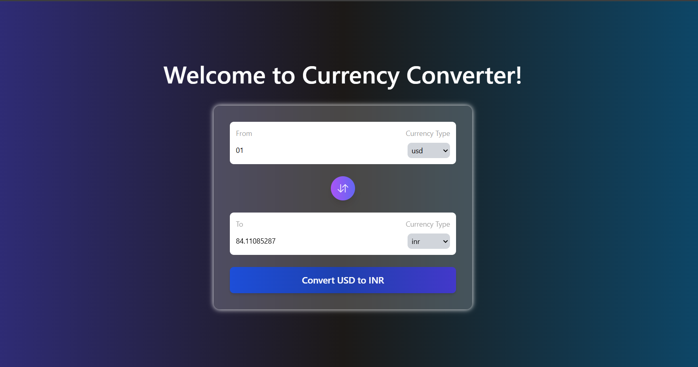

# Currency Converter 🌎💱

A sleek and stylish currency converter built with React, using real-time currency data for conversions. This project features an interactive UI with smooth transitions and a modern design, making it easy to convert between different currencies.

## Features
- **Real-time Conversion**: Convert between various currencies instantly.
- **Swap Functionality**: Easily swap the "from" and "to" currencies.
- **Stylish UI**: Modern, gradient-based design with interactive elements.
- **Responsive Design**: Works well across devices and screen sizes.

## Demo
  
*Replace with an actual screenshot or gif of your application in use.*

## Installation

1. Clone the repository:
   ```bash
   git clone https://github.com/mauryavinay1407/currency-converter.git
   cd currency-converter
   ```
2. Install dependencies:
   ```bash
   npm install
   ```
3. Start the development server:
   ```bash
   npm run dev
   ```
